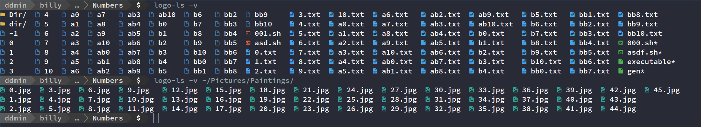

# logo-ls
## Fork of [logo-ls](https://github.com/Yash-Handa/logo-ls)

# ⚠ This is not good code ⚠

Just hacked together to include certain functionalities not present in the original
- directories are grouped first
- executables are grouped last
- numbers are ordered sanely

## Original License

The project is licensed under **MIT**. The Licence is available [here](/LICENSE).
